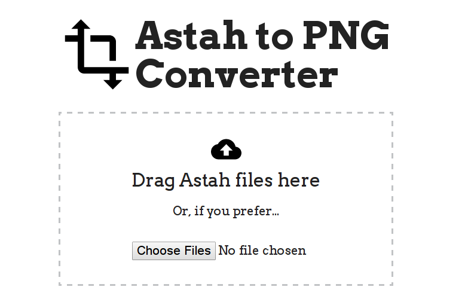

## Astah to PNG converter

A simple web interface and API that can export diagrams as images from
a [Astah](http://astah.net/) project files.

Try it out here: http://astah-converter.lukasmartinelli.ch/



## API

There is a single ressource `project` for an Astah project file.

### Upload project file

Make a POST request to the `projects` endpoint with a file upload named `upload`.

```bash
curl -F "upload=@UseCaseDiagram.astah" http://localhost/projects
```

```json
{
    "project_url":"http://localhost/projects/ee6a3d12a3b22305272badb76f39fe738c97eb3d",
    "exports":[
        {
            "export_url":"http://localhost/projects/ee6a3d12a3b22305272badb76f39fe738c97eb3d?file=UseCase Diagramm.png",
            "filename":"UseCase Diagramm.png"
        }
    ]
}
```

### Download exported image

Make a GET request to the exported file.

```bash
curl -O http://localhost/projects/ee6a3d12a3b22305272badb76f39fe738c97eb3d?file=UseCase Diagram.png"
```

## Deployment

The Dockerfile contains [Astah](http://astah.net/faq/professional/how-to-run-astah-on-linux), Oracle JDK7 and the latest Node.

I have already setup an automated build `lukasmartinelli/astah-converter`
which you can use.

```bash
docker pull lukasmartinelli/astah-converter
```

Or you can clone the repo and build the docker image yourself.

```bash
docker build -t lukasmartinelli/astah-converter .
```

Now you can run the image.

```bash
docker run -p 3000:3000 -it lukasmartinelli/astah-converter
```

### Deploy on CoreOS with fleet

I run the service on [CoreOS](https://coreos.com/).

1. Submit service file: `fleetctl submit astah-converter.service`
2. Start service: `fleetctl start astah-converter.service`

## Development

For developing I recommend mounting the current directory to the installation.

```
docker run -v $(pwd):/opt/astah-api -p 80:3000 -it lukasmartinelli/astah-converter

```

**Attention:** if you add additional Node packages you need to rebuild the image.
